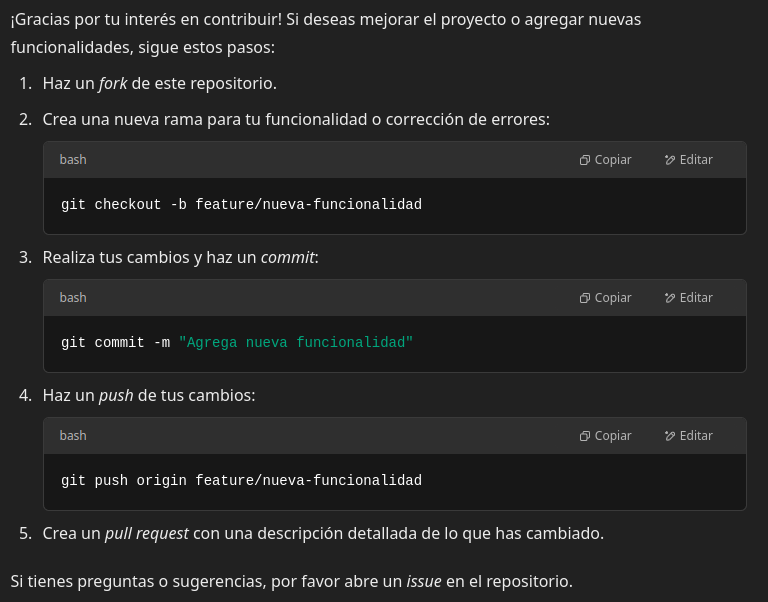

<div align="center">

# Proyecto Backend con Express

</div>

### Tecnologías utilizadas: _Express.js_ y _Mocha_ para realizar pruebas de los endpoints.

La aplicación proporciona un servidor básico con endpoints simples y está configurada para pruebas usando _supertest_ y _chai_.

---

## 🧰 Requisitos previos

- Node.js (v18 o superior recomendado)
- npm (v9 o superior recomendado)

---

## ⚙️ Instalación

1. Clona este repositorio:

```bash
git clone https://github.com/JJUANVOLPE/backend-test.git
cd backend-test
```

2. Instala las dependencias necesarias:

```bash
npm install
```

3. Si necesitas agregar dependencias manualmente, instala las siguientes:

```bash
npm install express cors body-parser dotenv bcryptjs jsonwebtoken firebase-admin
```

> ℹ️ [📦 Descripción de dependencias](#-descripción-de-dependencias)

---

## 🚀 Uso

### Iniciar el servidor:

```bash
npm start
```

### Ejecutar pruebas:

```bash
npm test
```

> ⚠️ **Posible error al correr pruebas**: Si ocurre un problema relacionado con la definición del script en `package.json`, asegúrate de que la línea correspondiente sea:
>
> ```json
> "test": "mocha"
> ```

---

## 📁 Estructura del Proyecto

```plaintext
backend-test/
├── src/
│   ├── app/
│   │   └── server.js        # Punto de entrada de la aplicación
│   ├── routes/
│   ├── controllers/
│   ├── services/
│   │   └── auth.service.js  # Lógica de autenticación
│   └── config/
│       └── firebase.js      # Configuración de Firebase Admin
├── test/
│   └── example.test.js      # Pruebas con Mocha + Chai + Supertest
├── .env                     # Variables de entorno
├── package.json
└── README.md
```

---

## 📡 Endpoints disponibles

### `GET /`

* **Descripción**: Endpoint principal de prueba.
* **Respuesta esperada**: Código `200` con el mensaje `"Hello World"`.

**Ejemplo de respuesta**:

```json
{
  "message": "Hello World"
}
```

* **Descripción**: Obtiene todos los productos públicos.
* **Respuesta esperada**:

```json
[
  { "id": "abc123", "name": "Laptop", "price": 1500, "stock": 10 },
  { "id": "def456", "name": "Mouse", "price": 25, "stock": 100 }
]
```

#### `POST /api/products` *(Requiere JWT)*

* **Descripción**: Crea un nuevo producto.
* **Encabezados requeridos**:

```http
Authorization: Bearer <token>
```

* **Cuerpo esperado**:

```json
{
  "name": "Teclado",
  "price": 40,
  "stock": 80
}
```

* **Respuesta esperada**:

```json
{ "id": "xyz789", "name": "Teclado", "price": 40, "stock": 80 }
```

---


#### `DELETE /api/products/:id` *(Requiere JWT)*

* **Descripción**: Elimina un producto por ID.
* **Encabezados requeridos**:

```http
Authorization: Bearer <token>
```

* **Respuesta esperada**:

```json
{ "message": "Producto eliminado correctamente" }
```

---

### 🔐 Autenticación (`/api/login` y `/api/register`)

#### `POST /api/login`

* **Descripción**: Autentica un usuario y devuelve un token.
* **Cuerpo esperado**:

```json
{
  "email": "admin@site.com",
  "password": "123456"
}
```

* **Respuesta esperada**:

```json
{ "token": "..." }
```

---

#### `POST /api/register`

* **Descripción**: Registra un nuevo usuario.
* **Cuerpo esperado**:

```json
{
  "email": "nuevo@user.com",
  "password": "123456",
  "name": "Juan"
}
```

* **Respuesta esperada**:

```json
{
  "id": "abc123",
  "email": "nuevo@user.com",
  "name": "Juan"
}
```

---


## 🔒 Limitaciones

* Este proyecto es una base de pruebas y no está listo para producción sin:

  * Validaciones robustas.
  * Manejo de errores centralizado.
  * Seguridad en la gestión de JWT y datos sensibles.
  * Pruebas más completas.
  * Agregado de funcionalidades para la actualización de productos
* No incluye base de datos persistente por defecto.

---

## ☁️ Despliegue

Este proyecto puede desplegarse fácilmente en servicios como **Render**, **Railway**, **Vercel (APIs)** o incluso **Firebase Functions**. Para ello:

1. Define variables de entorno en producción.
2. Asegúrate de tener un `start` script en `package.json`.
3. Configura los puertos correctamente (`process.env.PORT`).
4. No olvides ignorar archivos sensibles como `.env`.

---

## 🤝 Contribuciones



¿Quieres aportar? Haz un fork, crea una rama y envía un PR.

---

## 📦 Descripción de dependencias

Estas librerías cumplen las siguientes funciones:

* **express**: Framework web para manejar rutas y peticiones HTTP.
* **cors**: Middleware para permitir solicitudes entre dominios (Cross-Origin).
* **body-parser**: Permite interpretar el cuerpo de las solicitudes.
* **dotenv**: Carga variables de entorno desde un archivo `.env`.
* **bcryptjs**: Para hashear contraseñas de forma segura.
* **jsonwebtoken**: Para manejar autenticación con tokens JWT.
* **firebase-admin**: Para integraciones con Firebase desde el backend.

---
